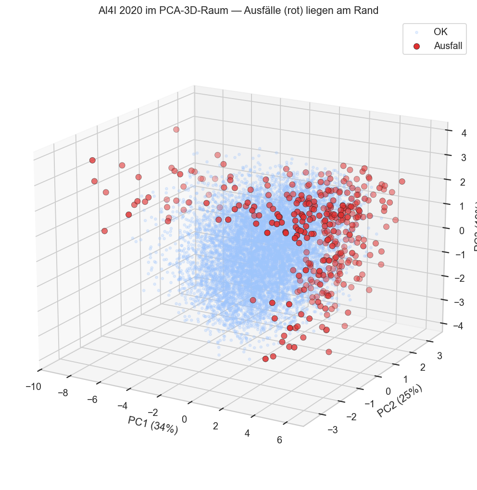
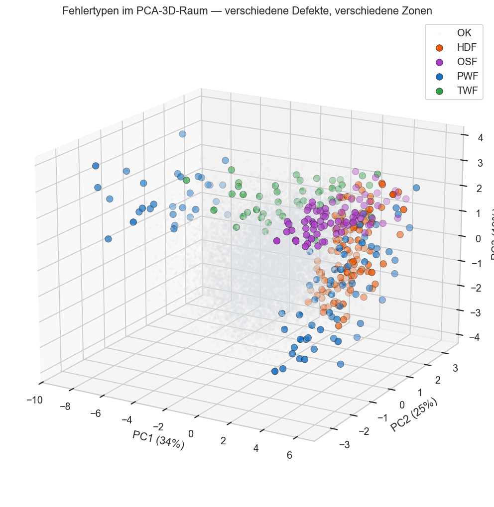
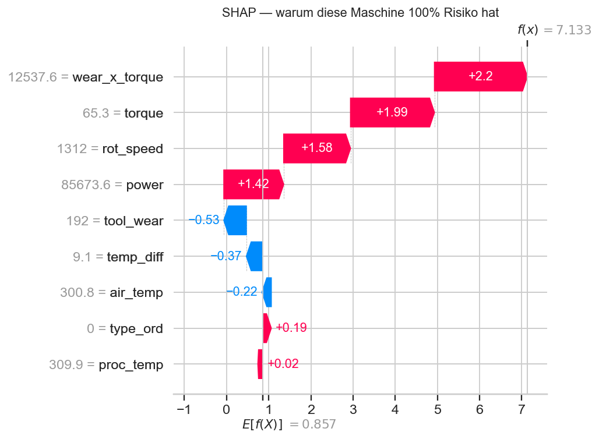

## 🚀 Live Demo

Die interaktive Streamlit-App dieses Projekts ist online verfügbar:
**[👉 zur Live-App](https://predictive-maintenance-alex-sagert.streamlit.app/)**

Features:
- 🎚️ Sensor-Schieberegler für alle Maschinenparameter (Temperatur, Drehzahl, Drehmoment, Verschleiß)
- 🔧 Ausfallrisiko in Echtzeit als Tacho-Anzeige (grün / gelb / rot)
- 💶 Integrierter Kostenrechner: geplante Wartung vs. ungeplanter Ausfall → erwartete Ersparnis
- 📅 **Forecast & Wartungsfahrplan:** Risikokurve über Kalenderdaten (Verschleiß als Zeitachse),
  konkrete Wartungstermine („Wartung bis TT.MM. einplanen") und Flotten-ROI mit Break-Even-Punkt
- 📊 **Analysen-Tab:** Clustering & 3D-Raum, Anomalie-Erkennung, Ensemble-Vergleich & SHAP,
  AutoML-Benchmark – die vertiefenden Ergebnisse direkt in der App

## 📊 Präsentation

Die Projektpräsentation liegt im Repo und ist auch online verfügbar:
- 📥 **[PowerPoint (PPTX)](praesentation/Predictive-Maintenance-Praesentation.pptx)** — herunterladen
- 🌐 **[Online-Version (Gamma)](https://gamma.app/docs/0f3dw4mt8klx5zm)**

## 🧭 Clusteranalyse & 3D-Visualisierung

Wo im Merkmalsraum sitzen die Ausfälle? Das Companion-Notebook
[`15-predictive-maintenance-clusteranalyse-3d-AS.ipynb`](15-predictive-maintenance-clusteranalyse-3d-AS.ipynb)
projiziert die Sensordaten per PCA in den 3D-Raum und sucht mit Clustering nach Risikozonen.

| Ausfälle im 3D-Raum | Fehlertypen im 3D-Raum |
|---|---|
|  |  |

Die Ausfälle (rot) liegen **strukturiert am Rand** des Raums (kein Rauschen, sondern Physik),
und verschiedene Fehlertypen besetzen **verschiedene Zonen**. Ein **drehbarer, interaktiver
3D-Plot** liegt unter [`visualisierung/03_pca_3d_interaktiv.html`](visualisierung/03_pca_3d_interaktiv.html)
(im Browser öffnen, offline lauffähig).

## 🤖 AutoML-Benchmark (PyCaret)

[`18-predictive-maintenance-automl-pycaret-AS.ipynb`](18-predictive-maintenance-automl-pycaret-AS.ipynb)
vergleicht das handgebaute, mit Optuna getunte XGBoost gegen eine automatische ML-Pipeline
(PyCaret, ~15 Modelle per Cross-Validation). PyCaret lief in einer **isolierten** Umgebung
(verlangt ältere numpy/pandas/sklearn), damit das Projekt-Environment unberührt bleibt.

**Ergebnis:** Auch AutoML landet bei **Boosting** (Sieger LightGBM, AUC 0,97) — verblüffend nah am
hand­getunten XGBoost (ROC-AUC 0,98). Die schönste Lektion liefert der **Dummy-Classifier**:
96,6 % Accuracy bei AUC 0,5 und Recall 0 % — der Beweis, warum dieses Projekt auf **Recall/PR-AUC**
statt Accuracy optimiert.

## 🧩 Ensemble-Vergleich & Erklärbarkeit (SHAP)

Das Companion-Notebook
[`17-predictive-maintenance-ensembles-erklaerbarkeit-AS.ipynb`](17-predictive-maintenance-ensembles-erklaerbarkeit-AS.ipynb)
zeigt die ganze Ensemble-Progression — **ein Baum → Bagging (Random Forest) → Boosting (XGBoost)
→ Stacking** — und erklärt das Modell mit **Permutation Importance** und **SHAP**.

| Modell | PR-AUC | F1 |
|---|---|---|
| 1 Baum (Decision Tree) | 0,77 | 0,53 |
| Bagging (Random Forest) | 0,87 | 0,83 |
| **Boosting (XGBoost, Optuna)** | **0,89** | 0,81 |
| Stacking (LR+RF+XGB) | 0,88 | **0,88** |

Mit **SHAP** lässt sich jede einzelne Vorhersage aufschlüsseln — keine Black Box:



## 🔎 Ausreißer- & Anomalie-Erkennung (unüberwacht)

Das Companion-Notebook
[`16-predictive-maintenance-anomalie-erkennung-AS.ipynb`](16-predictive-maintenance-anomalie-erkennung-AS.ipynb)
findet auffällige Maschinen **ganz ohne Labels** (Isolation Forest, LOF, Elliptic Envelope) —
der „Cold-Start"-Fall, wenn noch keine Ausfall-Historie existiert. Der Nachweis: Die markierten
Anomalien treffen echte Ausfälle **~10× besser als Zufall** (Isolation Forest: Precision 0,33 bei
Basisrate 0,034, ROC-AUC 0,86) — und das, obwohl die Verfahren die Ausfall-Labels nie gesehen haben.

## 🖥️ Lokal starten

```bash
# Virtual Environment
python -m venv .venv
.\.venv\Scripts\Activate.ps1   # Windows
source .venv/bin/activate       # macOS/Linux

# Bibliotheken installieren
pip install -r requirements.txt        # nur App
pip install -r requirements-dev.txt    # zusätzlich für das Notebook (Optuna, Jupyter)

# Notebook (vollständige Analyse)
jupyter notebook 14-predictive-maintenance-projektarbeit-AS.ipynb

# Streamlit-App
streamlit run app.py
```

# Predictive Maintenance — Vorausschauende Wartung mit Machine Learning

**Projektarbeit Machine Learning — educx Weiterbildung**
**Autor:** Alexander Sagert • **Stand:** Juni 2026

Vorhersage von Maschinenausfällen aus Sensordaten, damit Wartung *geplant* statt *reaktiv* erfolgt — ein klassischer Industrie-4.0- und KI-ROI-Use-Case. Auf Basis des AI4I-2020-Datensatzes wird ein XGBoost-Modell trainiert, das drohende Ausfälle frühzeitig erkennt. Eine Streamlit-App macht das Modell live bedienbar und übersetzt das Risiko direkt in Euro.

---

## Fragestellung

Können wir aus Maschinen-Sensordaten zuverlässig erkennen, **bevor** eine Maschine ausfällt — und lohnt sich ein vorausschauender Eingriff wirtschaftlich?

Konkret untersucht werden:

1. Welche Sensorgrößen sind die stärksten Frühindikatoren für einen Ausfall?
2. Wie geht man mit der starken Unwucht der Daten um (nur 3,4 % Ausfälle)?
3. Welche Modellgüte ist erreichbar, wenn man auf **Recall** statt auf Accuracy optimiert?
4. Welcher konkrete **Geschäftsnutzen** (ROI) ergibt sich aus rechtzeitiger Wartung?

---

## Datensatz

| Quelle | Datei | Umfang | Lizenz |
|---|---|---|---|
| UCI — AI4I 2020 Predictive Maintenance Dataset | `data/ai4i2020.csv` | 10.000 Zeilen × 14 Spalten | CC BY 4.0 |

**Eingangsgrößen:** Produktqualität/Typ (L/M/H), Lufttemperatur, Prozesstemperatur, Drehzahl (rpm), Drehmoment (Nm), Werkzeugverschleiß (min).
**Zielgrößen:** `Machine failure` (binär) sowie 5 konkrete Fehlertypen (TWF, HDF, PWF, OSF, RNF).
**Besonderheit:** stark unausgewogen — nur ~3,4 % Ausfälle. Synthetisch, aber realitätsnah; vollständig lokal, kein API-Zugriff.

---

## Verzeichnisstruktur

```
predictive-maintenance-ml/
├── data/
│   └── ai4i2020.csv                              (Datensatz, UCI AI4I 2020)
├── dokumentation/
│   └── Dokumentation_Nachvollziehbare_Schritte_… .docx (Abgabe-Dokumentation)
├── praesentation/
│   └── Predictive-Maintenance-Praesentation.pptx (Projektpräsentation)
├── visualisierung/
│   ├── 01_pca_3d_ausfaelle.png                   (3D-Raum: Ausfälle hervorgehoben)
│   ├── 02_pca_3d_fehlertypen.png                 (3D-Raum: nach Fehlertyp)
│   ├── 03_pca_3d_interaktiv.html                 (interaktiver, drehbarer 3D-Plot)
│   ├── 04_dendrogramm.png                        (hierarchisches Clustering)
│   ├── 05_kmeans_3d_risikozonen.png              (K-Means-Risikozonen im 3D-Raum)
│   ├── 06_methodenvergleich.png                  (K-Means vs. Ward vs. DBSCAN)
│   ├── 07_boxplots_sensoren.png                  (univariate Ausreißer je Sensor)
│   ├── 08_anomalie_scoreverteilung.png           (Anomalie-Score: OK vs. Ausfall)
│   ├── 09_anomalien_3d.png                        (Anomalien im 3D-Raum)
│   ├── 10_ensemble_vergleich.png                 (Baum/Bagging/Boosting/Stacking)
│   ├── 11_permutation_importance.png             (globale Feature-Wichtigkeit)
│   ├── 12_shap_beeswarm.png                      (SHAP global)
│   ├── 13_shap_waterfall.png                     (SHAP für eine konkrete Maschine)
│   └── 14_pycaret_leaderboard.png                (AutoML-Leaderboard)
├── pycaret_results/
│   ├── leaderboard.csv                           (PyCaret-Benchmark-Ergebnisse)
│   └── run_benchmark.py                          (Reproduktion, isolierte venv)
├── 14-predictive-maintenance-projektarbeit-AS.ipynb   (Haupt-Notebook, vollständige Analyse)
├── 15-predictive-maintenance-clusteranalyse-3d-AS.ipynb (Clusteranalyse & 3D-Visualisierung)
├── 16-predictive-maintenance-anomalie-erkennung-AS.ipynb (Ausreißer- & Anomalie-Erkennung)
├── 17-predictive-maintenance-ensembles-erklaerbarkeit-AS.ipynb (Ensembles & SHAP-Erklärbarkeit)
├── 18-predictive-maintenance-automl-pycaret-AS.ipynb  (AutoML-Benchmark vs. PyCaret)
├── app.py                                        (Streamlit-Demo: Tacho, Kostenrechner, Forecast)
├── model.joblib                                  (exportiertes, getuntes XGBoost-Modell)
├── requirements.txt                              (App-/Deployment-Abhängigkeiten)
├── requirements-dev.txt                          (+ Notebook-Werkzeuge)
└── README.md                                     (diese Datei)
```

---

## Reproduktions-Anleitung

### Voraussetzungen

- **Python** ≥ 3.10
- Speicherplatz: ca. 50 MB (Daten + venv)
- Empfohlen: **VS Code mit Jupyter-Extension**

### Schritt 1 — Projekt holen

```bash
git clone https://github.com/alex-sagert/predictive-maintenance-ml.git
cd predictive-maintenance-ml
```

### Schritt 2 — Virtual Environment aufsetzen

```powershell
python -m venv .venv
.\.venv\Scripts\Activate.ps1          # Windows
pip install -r requirements-dev.txt   # App + Notebook
```

Auf macOS / Linux: `python3 -m venv .venv && source .venv/bin/activate && pip install -r requirements-dev.txt`

### Schritt 3 — Notebook ausführen

`14-predictive-maintenance-projektarbeit-AS.ipynb` öffnen, das `.venv` als Kernel wählen und **„Run All"**. Erwartete Laufzeit: ca. 30 Sekunden (inkl. Optuna-Tuning). Am Ende wird `model.joblib` neu geschrieben.

### Schritt 4 — App starten

```bash
streamlit run app.py
```

> Die App lädt automatisch `model.joblib`. Fehlt die Datei, trainiert sie beim Start ein Fallback-Modell direkt aus der CSV.

---

## Methodik

### ML-Workflow

1. **EDA** — Zielverteilung, Sensor-Verteilungen nach Ausfall, Korrelationen.
2. **Feature Engineering** — Domänen-Features: Temperaturdifferenz, mechanische Leistung (Drehmoment × Drehzahl), Verschleiß × Drehmoment.
3. **Unausgewogene Daten** — Vergleich `class_weight` vs. **SMOTE** (nur auf Trainingsdaten, Leakage-frei in einer `imblearn`-Pipeline).
4. **Modellierung** — Baselines (Logistische Regression, Decision Tree) bis **Boosting (XGBoost)**.
5. **Hyperparameter-Tuning** — **Bayes-Optimierung mit Optuna** (30 Trials, Zielgröße: mittlere PR-AUC in stratifizierter Cross-Validation).
6. **Evaluation** — Recall, PR-AUC, Confusion Matrix, Precision-Recall-Kurve, Feature Importance, bewusste Schwellenwert-Wahl.

### Warum Recall statt Accuracy

Bei 3,4 % Ausfällen erreicht ein Modell, das *immer* „kein Ausfall" sagt, schon ~96,6 % Accuracy — und ist wertlos. Da ein übersehener Ausfall (False Negative) ungleich teurer ist als ein Fehlalarm (False Positive), wird der Schwellenwert bewusst auf ein **Recall-Ziel ≥ 90 %** gesenkt.

### Verwendete Methoden

- `train_test_split` (stratifiziert), `StandardScaler`, ordinale Kodierung
- `LogisticRegression`, `DecisionTreeClassifier`, `XGBClassifier` (`scale_pos_weight`)
- `imblearn.SMOTE` in einer leakage-freien Pipeline
- `optuna` mit `TPESampler` + `StratifiedKFold`
- Metriken: `average_precision_score` (PR-AUC), `recall_score`, `classification_report`, `precision_recall_curve`
- **Bonus:** Multiklassen-Fehlertyp (`multi:softprob`) und unsupervised `KMeans`-Clustering der Betriebszustände

---

## Wichtigste Erkenntnisse

**Modellvergleich (Test-Set):**

| Modell | Recall | Precision | F1 | PR-AUC | ROC-AUC |
|---|---|---|---|---|---|
| Logistische Regression | 0,88 | 0,18 | 0,30 | 0,43 | 0,94 |
| Decision Tree | 0,82 | 0,39 | 0,53 | 0,77 | 0,86 |
| XGBoost (class weights) | 0,82 | 0,88 | 0,85 | 0,88 | 0,99 |
| XGBoost (SMOTE) | 0,79 | 0,68 | 0,74 | 0,85 | 0,98 |
| **XGBoost + Optuna (final)** | **0,82** | **0,80** | **0,81** | **0,89** | **0,98** |

1. **Boosting schlägt die Baselines deutlich** — die PR-AUC steigt von 0,43 (LogReg) auf 0,89 (getuntes XGBoost).
2. **Recall-optimierter Schwellenwert (0,092):** das finale Modell erkennt **62 von 68 echten Ausfällen** (Recall 0,91) bei vertretbar wenigen Fehlalarmen.
3. **Stärkste Treiber** der Vorhersage: Drehmoment, Werkzeugverschleiß und mechanische Leistung.
4. **Unwucht-Handling:** `class_weight` schlägt SMOTE auf diesen Daten leicht — internes Gewichten genügt.
5. **Fehlertyp-Erkennung (Bonus):** HDF, PWF und OSF werden gut erkannt; TWF kaum (nur 9 Testfälle — zu wenig Signal).

---

## Limitationen

- **Synthetische Daten.** Kein echter Sensordrift, keine Zeitreihen-/Degradationsdynamik.
- **Schwellenwert ist eine Geschäftsentscheidung.** Die Wahl hängt vom Kostenverhältnis FN/FP ab, nicht von einem festen ML-Wert.
- **Keine Restlebensdauer (RUL).** Das Modell sagt „Ausfall ja/nein", nicht „in X Stunden".
- **TWF unterrepräsentiert.** Für den Fehlertyp TWF reichen die Fälle für ein robustes Modell nicht aus.

---

## Mögliche Weiterführungen

- **Restlebensdauer-Prognose (RUL)** auf Zeitreihendaten (z. B. NASA Turbofan).
- **Kostensensitives Lernen** — Schwellenwert direkt aus FN-/FP-Kosten ableiten.
- **Monitoring & Drift-Erkennung** für den produktiven Betrieb.
- **Erklärbarkeit** mit SHAP-Werten je Vorhersage.
- **Deployment-Härtung** — Modellversionierung, Feedback-Loop mit Wartungsrückmeldungen, ROI-Tracking.

---

## Verwendete Software

- Python ≥ 3.10
- pandas, numpy, scikit-learn, **xgboost**, imbalanced-learn, **optuna**, matplotlib, seaborn
- streamlit (Demo), joblib (Modell-Export)
- Versionen siehe `requirements.txt` / `requirements-dev.txt`

---

## Kontakt

Erstellt im Rahmen der **educx Machine-Learning-Weiterbildung**, Juni 2026.
Autor: **Alexander Sagert**
